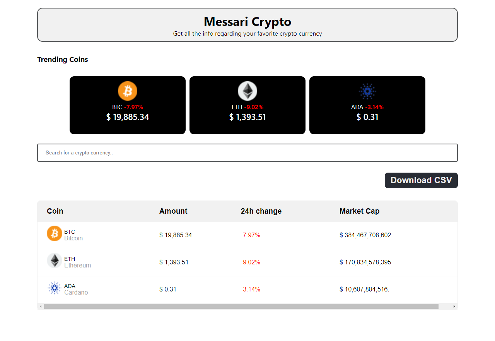

# React | TypeScript | Styled Components

## Used technology

- [React](https://reactjs.org/)
- [TypeScript](https://www.typescriptlang.org/)
- [Styled Components](https://styled-components.com/)
- [Messari API](https://messari.io/api)

## Requirements

- [Node.js](https://nodejs.org/) v16 or newer, [NPM](https://www.npmjs.com/) package manager

## Getting Started

1. Clone repository
```
$ git clone https://github.com/pedroriverove/messari-crypto-frontend.git
```
2. Change into the working directory
```
$ cd messari-crypto-frontend
```
3. Copy `.env.example` to `.env` and modify according to your environment
```
$ cp .env.example .env
```
4. Install project dependencies
```
$ npm install
```
5. Finally, launch the app
```
$ npm start
```

## Scripts

- `npm start` — Launches the app in development mode on [`http://localhost:3000`](http://localhost:3000/)

## Related Projects

- [Messari Crypto Backend](https://github.com/pedroriverove/messari-crypto-backend) — project template, pre-configured with Express and Typescript

## Screenshot


